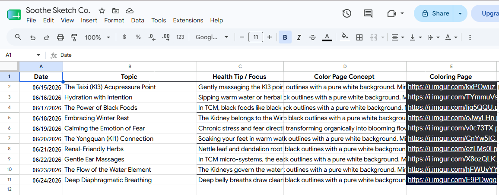
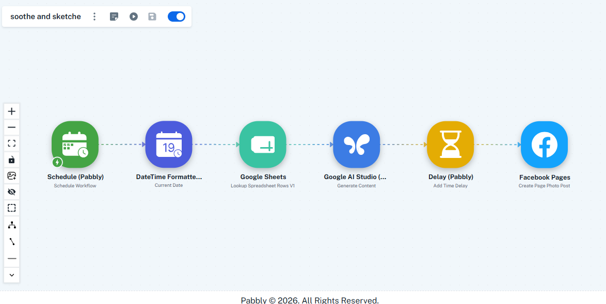
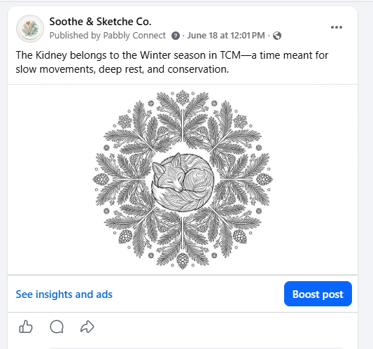

# Automated Daily Facebook Content Pipeline

## Overview
I built an automated system that generates, designs, and posts daily content to Facebook with **zero manual intervention**. The entire workflow runs on a schedule using Pabbly Connect, Google Sheets, and AI APIs.

## The Problem I Solved
- Manual daily posting takes 20-45 minutes per day
- Maintaining consistency across multiple posts is tedious
- Need to manage both text and image content

## My Solution

### How It Works (Step by Step)

1. **Content Generation** → Use a Gemini AI prompt to generate daily post text
2. **Spreadsheet Organization** → Store all posts and image links in Google Sheets
3. **Image Generation** → Create/source images for each post (links stored in sheet)
4. **Automation Layer** → Pabbly Connect reads the sheet and automatically posts to Facebook on a daily schedule

### Tech Stack
- **Pabbly Connect** - Workflow automation & scheduling
- **Google Gemini API** - AI text generation
- **Google Sheets** - Data storage & organization
- **Facebook API** (via Pabbly) - Social posting

## Why This Matters
## Key Features
✅ Fully automated daily posting
✅ AI-generated content
✅ Centralized content management in Sheets
✅ Zero ongoing manual effort
✅ Scalable to other platforms

## Tools & Skills Demonstrated
- API integration (Gemini, Facebook, Google)
- Workflow automation & scheduling
- Data management (Google Sheets)
- Problem-solving & process optimization
- Cost optimization (pre-generating images)

## Results
- **Posting frequency**: Daily (100% consistency)
- **Time saved**: ~7 hours/week
- **Status**: Currently running in production

---

*This project demonstrates my ability to build scalable, automated solutions that solve real workflow problems.*

## Visual Walkthrough

### Google Sheets Setup

### Pabbly Automation Workflow

### Live Example

- **Efficiency**: Removed ~7 hours/week of manual posting
- **Consistency**: Daily posts without fail
- **Scalability**: Can easily add more social platforms
- **Cost Optimized**: Pre-generate images to avoid API credit waste

## The Workflow Diagram
